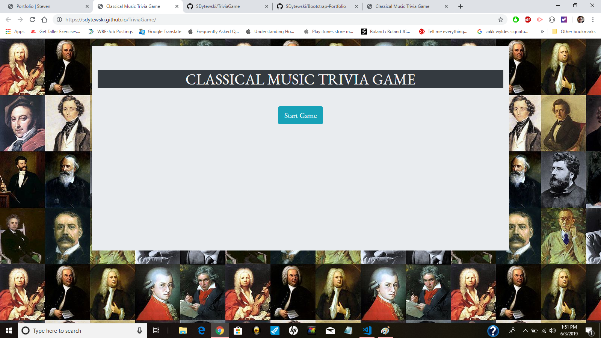
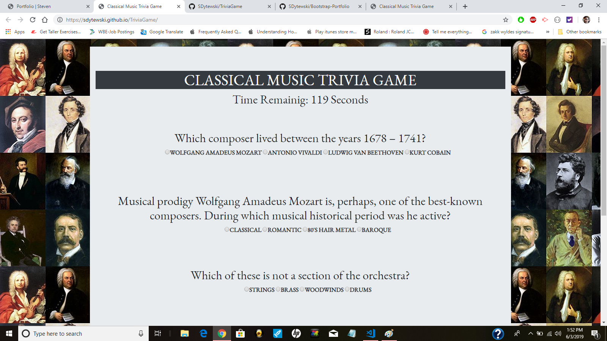
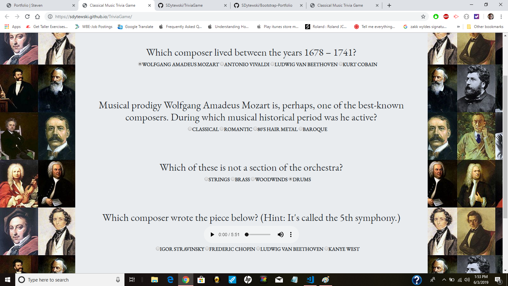
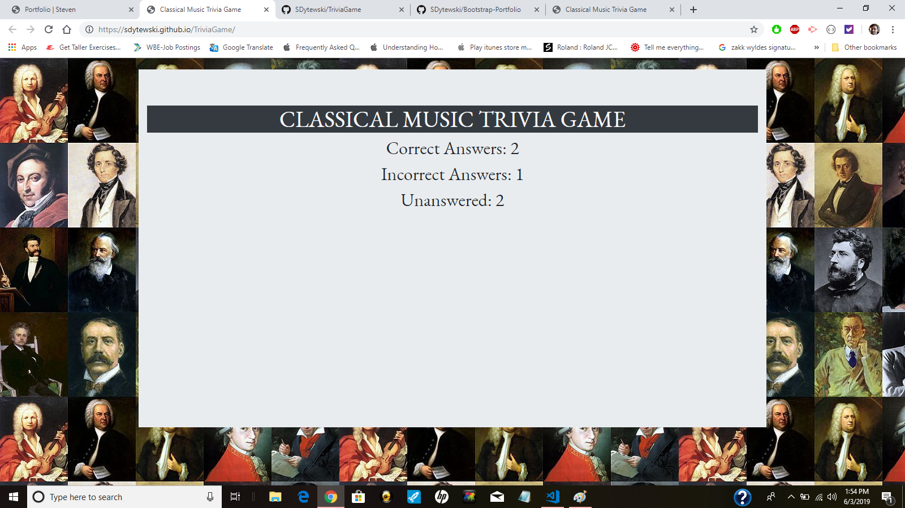

# Classical Music Trivia

In this application, I created a trivia game featuring classical music. The app calculates how many questions a user gets wrong, right, or unanswered. A score is tallied depending on these variables. I used HTML, Bootstrap, CSS, JavaScript, and JQuery.  

**Example 1** A start button is shown on the landing page.  Once a user clicks the "Start Game" button then the game begins. 

**Example 2** Five questions appear on the screen. A timer starts at 120 seconds and begins to count down. The countown  features the setInterval command for JavaScript timing events.

**Example 3**
 The user can can pick 1 one of 4 answers for each of the 5 questions. If a user doesn't answer a question, it will be added to the "Unanswered" score. If a user picks an answer, it can be correct or incorrect. Here I have selected a few answers and have left other questions unanswered.  The bottom question features a sound file that can be played.
 
 
 

 **Example 4** Once a user clicks "done," the timer ends. The questions will disappear and a score will  reveal a number for each of the "Correct", "Incorrect", or "Unaswered" scores.
If a user runs out of time and doesn't hit the "done" button before the 120 seconds end, then a score will be tallied with a number for each of the "Correct" "Incorrect" or "Unaswered" scores.       

# Conclusion

This project is useful because it uses a timer function in JavaScript and several variables depending on the users choice. It makes use of functions for hiding and revealing elements on the screen.  An audio file can be clicked for one question which makes the user experience more dynamic.  This is a mobile friendly app. 

